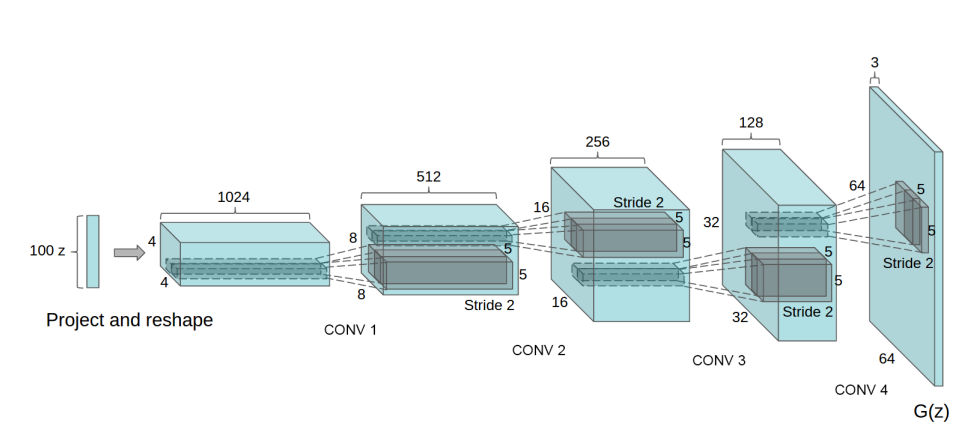

# Unsupervised Representation Learning with Deep Convolutional Generative Adversarial Networks 

<i>Figure 1. DCGAN generator model architecture</i>

 

The model proposed in this paper is known as <b> Deep Convolutional Generative Adversarial Networks (DCGAN)</b>. 
In this paper, authors upgrade <b> Generative Adversarial Networks (GAN) </b> by changing multi-layer perceptron to convolutional neural network so
they stabilize the training process of the model.

Core to their appoach to stabilize the training process of the GAN is as below.

* Replace all pooling layers with strided convolutions (discriminator) and fractional-strided convolutions (generator). 

* Remove all fully connected hidden layer. Connect input directly to the convolutional layer (see Figure 1).

* Use batch normalization for every layer except for input layer of discriminator and output layer of generator.

* Use leaky ReLU activation in discriminator for all layers and ReLU activation in generator for all layers except for the output which uses tanh. 

